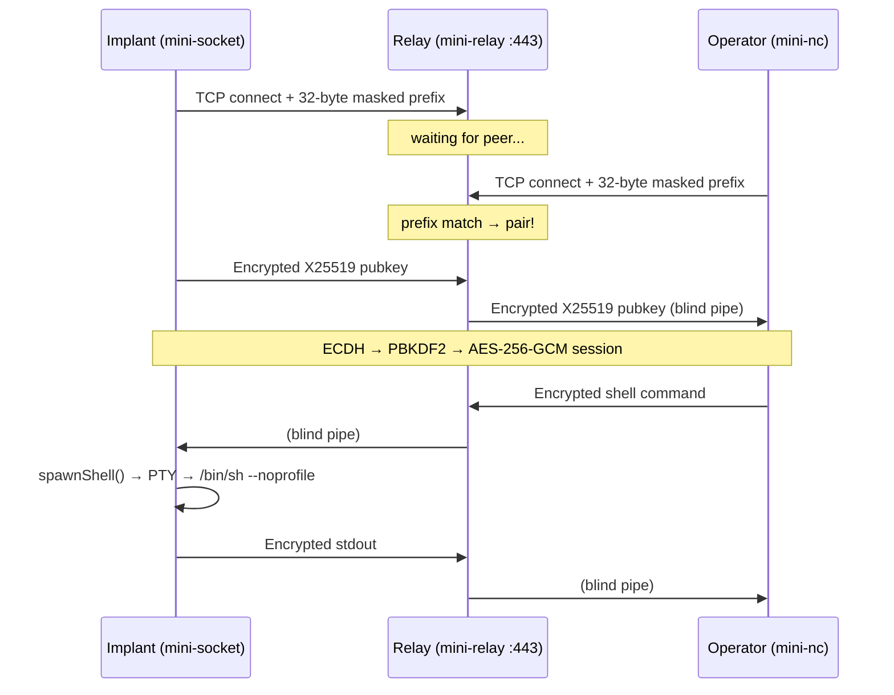

# minisocket — Reverse-Engineered Remote Access Toolkit

**Three Go binaries** reverse-engineered from stripped ELF samples (Go 1.22.12, linux/amd64) plus a shell-based deployment orchestrator. The toolkit provides an end-to-end encrypted remote shell over a blind relay, using pre-shared secret rendezvous with X25519 + AES-256-GCM.

---

## Project Layout

```
minisocket/
├── cmd/
│   ├── mini-nc/main.go          # Operator console — connects to relay, gets shell
│   └── client/main.go           # Implant daemon — connects to relay, spawns PTY
├── relay/main.go                # Rendezvous relay — pairs peers by secret, blind pipe
├── internal/
│   ├── proto/proto.go           # Shared wire protocol: framing, ECDH, XOR masking
│   └── crypto/crypto.go         # Shared encryption: AES-GCM + PBKDF2 + secret gen
├── origin/
│   ├── mini-nc                  # Original operator binary (reference)
│   ├── mini-socket_linux-x86_64 # Original implant binary (reference)
│   └── install.sh               # Original deploy script (reference)
├── install-sh-analysis.md       # Full analysis of the deployment orchestrator
├── mini-nc-analysis.md          # Full analysis of the operator console
├── go.mod / go.sum
└── README.md
```

## Components

### Three Binaries

| Binary | Module Path | Role | Default Port | Source |
|--------|------------|------|-------------|--------|
| `mini-nc` | `cmd/mini-nc` | Operator console — interactive shell, one-shot exec, pipe mode, liveness check | 5555 | Reversed from original |
| `mini-socket` | `cmd/client` | Implant daemon — PTY shell spawner, auto-reconnect, multi-session | 443 | Reversed from original |
| `mini-relay` | `relay/` | Rendezvous relay — pairs peers by 32-byte masked prefix, blind bidirectional pipe | 443 | New, inspired by gsocket-relay |

### + Deployment Orchestrator

`install.sh` (1019-line POSIX shell script, analyzed in `install-sh-analysis.md`):
- Downloads `mini-socket` from GitHub Releases (`minisocket/minisocket` v0.3)
- 11 architectures, 6 init systems, 14 root persistence methods, 4 user persistence methods
- memfd_create noexec bypass, Telegram exfiltration, XOR-obfuscated secret storage

### Shared Packages

| Package | Functions | Used By |
|---------|-----------|---------|
| `internal/crypto` | `Encrypt`, `Decrypt`, `DeriveKey`, `SHA256Digest`, `GenRandomSecret` | All three binaries |
| `internal/proto` | `GenerateECDH`, `SharedSecret`, `MaskSecret`, `XORMask`, `SealPayload`, `ReadHeader`, `ReadFull`, `(*PacketHeader).Write` | mini-nc + mini-socket |

### Package `internal/crypto`

| Function | Role |
|----------|------|
| `SHA256Digest` | SHA-256 hash → 32-byte session ID from secret |
| `DeriveKey` | PBKDF2 over shared secret → AES-256 key |
| `Encrypt` | AES-256-GCM encrypt with random 12-byte nonce |
| `Decrypt` | AES-256-GCM decrypt |
| `GenRandomSecret` | Generate 22-char alphanumeric secret (`-g` flag) |

### Package `internal/proto`

| Function | Role |
|----------|------|
| `GenerateECDH` | X25519 ephemeral keypair |
| `SharedSecret` | X25519 ECDH shared secret |
| `MaskSecret` / `XORMask` | XOR obfuscation of wire handshake prefix |
| `SealPayload` | Encrypt payload for wire transmission |
| `(*PacketHeader).Write` | Write 5-byte frame header `[uint32 len][uint8 type]` |
| `ReadHeader` | Read 5-byte frame header |
| `ReadFull` | Read length-framed payload |

---

## Protocol Summary

```
Operator (mini-nc)                Relay (:443)                   Implant (mini-socket)
     |                                |                               |
     |-- XOR-masked(SHA256(secret)) ->|                               |
     |-- Encrypted(X25519 pubkey)  -->|                               |
     |                                |<-- relay pairs by session ID  |
     |<-- Encrypted(X25519 pubkey) ---|                               |
     |                                |                               |
     |<====== AES-256-GCM channel ========> (end-to-end, relay blind) |
```

1. Secret → SHA-256 → **session ID** → XOR-masked → sent as wire prefix (32 bytes)
2. X25519 ECDH handshake, encrypted with a key derived from the secret
3. Session key = PBKDF2(shared_secret)
4. All subsequent packets: 5-byte header `[uint32 len][uint8 type]` + AES-256-GCM payload
5. Relay reads only the 32-byte prefix; all subsequent bytes are piped blindly

---

## Build

```bash
# All three binaries (requires Go 1.22+)
go mod tidy

# Operator console
CGO_ENABLED=0 go build -ldflags="-s -w" -o mini-nc ./cmd/mini-nc

# Implant daemon
CGO_ENABLED=0 go build -ldflags="-s -w" -o mini-socket ./cmd/client

# Relay
CGO_ENABLED=0 go build -ldflags="-s -w" -o mini-relay ./relay
```

---

## Usage

### Operator Console (`mini-nc`)

```
  Usage: mini-nc [options] [relay-host]
  Options:
    -s SECRET    Secret key
    -k FILE      Read secret from file
    -p PORT      Relay port (default 5555)
    -e CMD       Execute command and exit
    -t           Test mode (check if online)
    -i [sh|bash] Force interactive with shell
    -q           Quiet mode
    -w SECS      Idle timeout seconds (default 3)
    -C           No reconnect
    -n           No profile (norc + noprofile)
    -R           No RC
    -P           No profile
    -S sh|bash   Force shell preference
  Environment:  MINI_PORT  MINI_HOST
```

### Implant Daemon (`mini-socket`)

```
  Usage: mini-socket [options] [relay-host]
  Options:
    -s SECRET    Secret key (22 chars)
    -k FILE      Read secret from file
    -p PORT      Relay port (default 443)
    -d           Daemon mode (background)
    -g           Generate random secret
    -h           Show this help
  Environment:  MINI_ARGS  MINI_PORT  MINI_HOST
```

### Relay (`mini-relay`)

```
  Usage: mini-relay [options]
  Options:
    -p PORT      TCP listening port (default 443)
    -v           Verbose logging
```

---

## Operational Flow



---

## Analysis Caveats

Values marked with `*` are plausible reconstructions — the originals require full disassembly to recover:

| Item | Status |
|------|--------|
| Default relay port for mini-nc (5555) | *Guessed |
| XOR mask key | *Guessed |
| PBKDF2 salt & iterations | *Guessed |
| Packet type opcodes | *Inferred from string context |
| All function signatures, package layout, wire protocol design | Verified from `.gopclntab` and `.rodata` |
| All three binary module paths (`cmd/mini-nc`, `cmd/client`) | Verified from `.go.buildinfo` |
| Full CLI help text for all three binaries | Verified from `.rodata` |

---

## Analysis Reports

| File | Covers |
|------|--------|
| `mini-nc-analysis.md` | Operator console — full static analysis of `mini-nc` |
| `install-sh-analysis.md` | Deployment orchestrator — 14 persistence methods, 11 architectures, Telegram exfiltration |

---

## Disclaimer

This project is a **reverse-engineering artifact** produced for analysis and research purposes. The original binaries are classified as malicious-capable remote-access tooling. Do not deploy or connect to untrusted infrastructure.
